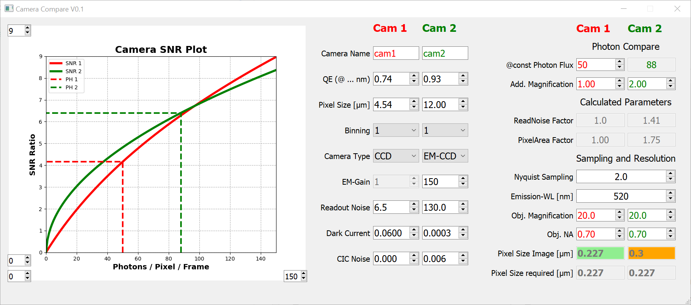

# Camera Compare

Simple tool to compare two cameras with respect to their detection efficiency and the resulting pixel sizes in the actual image.

The main purpose of this little tool is:

* mainly to educate and increase the "understanding" of those values
* **not** to create a real quantitative comparison of existing camera models

**Disclaimer: The code is purely experimental. Feel free to use it at your own risk. Chosen defaults are just "typical" values.**

## Explanations:

* **QE**: Quantum Efficiency of the detector
* **Pixel Size**: physical pixel size of the camera
* **Binning**: binning value of camera
* **Camera Type**: CCD, EM-CCD or CMOS
* **EM-Gain**: value of EM-gain (only valid for EM-CCDs)
* **Readout Noise**: noise during readout process chip (might vary depending on speed!)
* **Dark Current**: Noise created by dark current (might vary depending on cooling!)
* **Clock-induced charge**: spurious Noise appears in the form of Clock Induced Charge (CIC) in EMCCD technology.
* **Photon Flux**: number pf photons that get detected by a pixel on the chip
* **Addition Magnification**: USed to adapt the image pixel size to the desired sampling
* **ReadNoise Factor**: Uncertainty inherent to the signal multiplying process of EM-CCD = 1.41
* **PixelArea Factor**: Ratio of the physical pixel area of both detector. A factor of 2 means 4x the numver of detected photons per pixel! 
* **Nyquist Sampling**: desired sampling rate
* **Emission wavelength**: main emission wavelength of the detected signal
* **Objective magnification and NA**: parameters of the used objective(s)
* **Pixel Size Image**: resulting pixel size in image -> orange if too big for the desired sampling
* **Pixel Size required**: required pixel size to achieve the desired sampling

 
